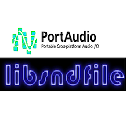

# Dub binding portaudio and sndfile for D

D bindings for the C libraries [PortAudio](http://www.portaudio.com/) and [libsndfile](http://www.mega-nerd.com/libsndfile/), permettant de générer, lire ou traiter de l'audio en temps réel avec le langage D.

---

## 🚀 Installation

Create new projet D avec `dub` :

```bash
dub init test
cd test
```

## Make sure PortAudio is installed on your system :

### macOS :
```bash
brew install portaudio
brew install libsndfile
```

### Linux (Debian/Ubuntu) :
```bash
sudo apt install libportaudio2 libportaudio-dev libsndfile1 libsndfile1-dev
```

### Windows :

Download and build PortAudio and libsndfile manually, or use MSYS2 or [vcpkg](https://vcpkg.io)..

## Testing examples (see examples dir)

```bash
dub run --config=readWav
```

```bash
dub run --config=play440hz
```

```bash
dub run --config=openFile
```

```bash
dub run --config=realTimeFilterOnWav
dub run --config=realTimeFilterOnWav --build=debug --verbose
```
